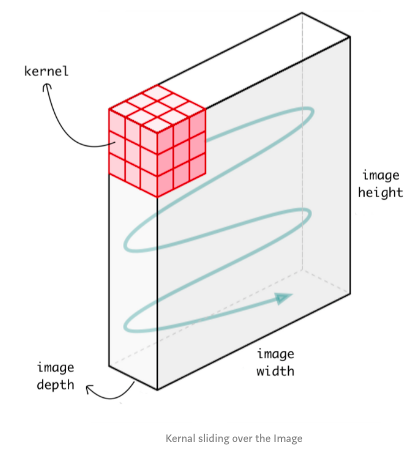

## A Convolution Neural Network (CNN) From Scratch With Python - Part 1

### Prerequisites
You must have Numpy (for math computations)

### Project Structure
Install dependencies if needed

```bash
$ pip install -r requirements.txt
```

Then, run it with no arguments:

```bash
$ python cnn.py
$ python cnn_keras.py
```

When we say Convolution Neural Network (CNN), generally we refer to a 2 dimensional CNN which is used for image classification. But there are two other types of CNNs used in the real world, which are 1 dimensional and 3 dimensional CNNs. In this guide, we are going to cover 1D and 3D CNNs and their applications in the real world.

### 2 dimensional CNN | Conv2D
This is the standard Convolution Neural Network which was first introduced in Lenet-5 architecture. Conv2D is generally used on Image data. It is called 2 dimensional CNN because the kernel slides along 2 dimensions on the data as shown in the following image.



The whole advantage of using CNN is that it can extract the spatial features from the data using its kernel, which other networks are unable to do. For example, CNN can detect edges, distribution of colours etc in the image which makes these networks very robust in image classification and other similar data which contain spatial properties.

### 1 dimensional CNN | Conv1D
Before going through Conv1D, let me give you a hint. In Conv1D, kernel slides along one dimension. Now let’s pause the blog here and think which type of data requires kernel sliding in only one dimension and have spatial properties?

The answer is Time-Series data. Let’s look at the following data.


This data is collected from an accelerometer which a person is wearing on his arm. Data represent the acceleration in all the 3 axes. 1D CNN can perform activity recognition task from accelerometer data, such as if the person is standing, walking, jumping etc. This data has 2 dimensions. The first dimension is time-steps and other is the values of the acceleration in 3 axes.

Following plot illustrate how the kernel will move on accelerometer data. Each row represents time series acceleration for some axis. The kernel can only move in one dimension along the axis of time.


Similarly, 1D CNNs are also used on audio and text data since we can also represent the sound and texts as a time series data. Please refer to the images below.


Conv1D is widely applied on sensory data, and accelerometer data is one of it.

### 3 dimensional CNN | Conv3D
In Conv3D, the kernel slides in 3 dimensions as shown below. Let’s think again which data type requires the kernel moving across the 3 dimension?


Conv3D is mostly used with 3D image data. Such as Magnetic Resonance Imaging (MRI) data. MRI data is widely used for examining the brain, spinal cords, internal organs and many more. A Computerized Tomography (CT) Scan is also an example of 3D data, which is created by combining a series of X-rays image taken from different angles around the body. We can use Conv3D to classify this medical data or extract features from it.


### Summary
* In 1D CNN, kernel moves in 1 direction. Input and output data of 1D CNN is 2 dimensional. Mostly used on Time-Series data.
* In 2D CNN, kernel moves in 2 directions. Input and output data of 2D CNN is 3 dimensional. Mostly used on Image data.
* In 3D CNN, kernel moves in 3 directions. Input and output data of 3D CNN is 4 dimensional. Mostly used on 3D Image data (MRI, CT Scans).
